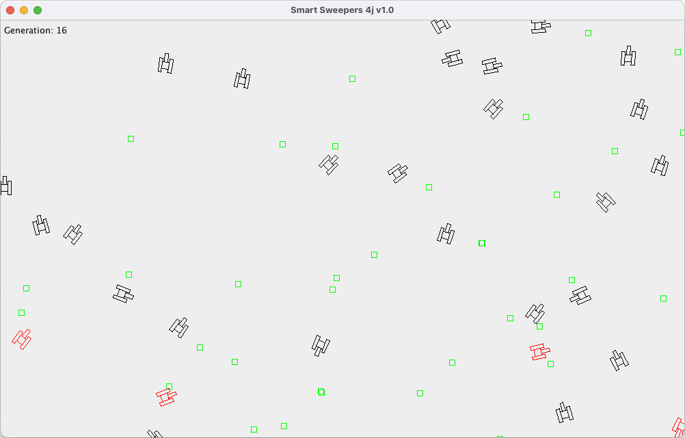
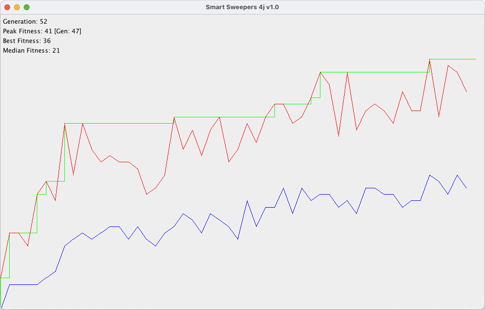

# SmartSweepers4j2kt
### Ostensibly: a Kotlin port of Smart Sweepers
‘ai-junkie’ wrote a Neural Network Tutorial, in the early 2000's, demonstrating it with a program to
simulate the evolution of tanks which sweep mines ... by way of a genetic algorithm.  Two interesting topics for the
price of one!  [This link](http://www.ai-junkie.com/ann/evolved/nnt1.html) directs you the start, (to bypass a home page in Flash).  We've got AI tools all over in
2024, but Smart Sweepers is still fun to watch and tweak.

Written in C++, others ported it to other languages, with Java by mbaeuerle [here](https://github.com/mbaeuerle/SmartSweepers4j)
who included some further work on ai-junkie's “Stuff to Try” exercises.  So why not Kotlin now too?

### But really: stepping a fun project through a Java to Kotlin conversion
#### Keeping the code-base working all the while, with minimal change to the remaining Java code
You'll likely get the best view by using your git-tool of choice on a local clone.
1. The end of the original SmartSweeper4j's commits are marked with the tag: [mbaeuerle](https://github.com/beegr/SmartSweepers4j2kt/releases/tag/mbaeuerle)
   1. This includes his further changes: adding traps to avoid, and changing the genetic algorithm
2. Conversion to the equivalent of the original SmartSweepers is on the main branch.
   1. Extending the conversion to the end of the further changes is marked with tag: [mb_kotlin](https://github.com/beegr/SmartSweepers4j2kt/releases/tag/mb_kotlin)

---
Below continues mbaeuerle's original README (tweaked a little)

---
This is a port of the C++ Smart Sweepers from http://www.ai-junkie.com

It is a program to simulate the evolution of tanks which sweep mines. For this it uses a genetic algorithm to select the fittest sweepers from one generation.
The direction in which a sweeper is heading is processed using a neural network.

- With <kbd>f</kbd> you can toggle between visual mode and **F**ast mode
- With <kbd>p</kbd> you can toggle **P**ause mode
- With <kbd>r</kbd> you can **R**estart from a new generation-zero
- With <kbd>q</kbd> you can **Q**uit
- The red ones are the top x elite tanks from the previous generation which are not permuted by the genetic algorithm
- Green mines increase the fitness of a sweeper when they collect it
- To alter the behavior and evolution you can change the settings in res/params.ini

